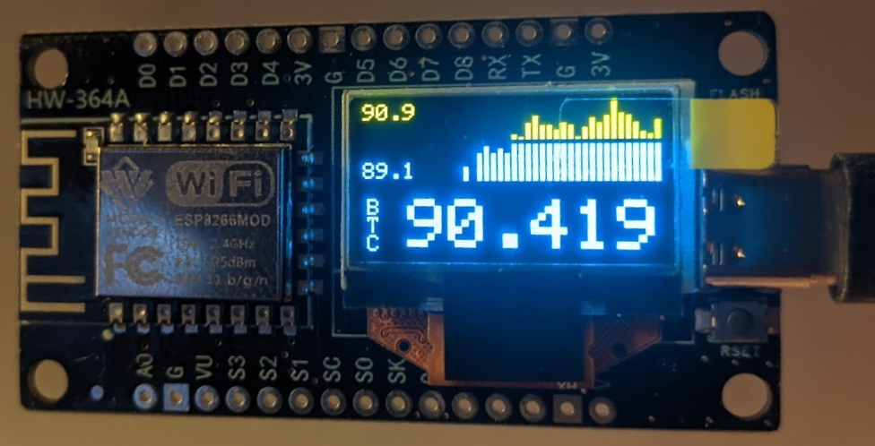

# Crypto Informer для ESP8266 с OLED дисплеем

## Описание проекта
**Crypto Informer** — проект для платы ESP8266 с OLED дисплеем 0,96" (128×64)
- **Подключается к Wi-Fi:** автоматически подключается к сохранённой сети или, в случае 2х неудачных попыток, создаёт собственную точку доступа для начальной настройки.
- **Получает данные по криптовалютам:** с помощью запросов к API Binance (публичный API, без авторизации) получает исторические данные свечей для выбранных криптовалют (по умолчанию BTC, ETH и BNB).
- **Отображает информацию на OLED:** Основной экран отображает график изменения курса, тикер и цену криптовалюты. При запуске на экран выводятся IP-адрес, статус подключения.

## Основные возможности
- **Wi-Fi и Конфигурация:**
  - Используется [WiFiManager](https://github.com/tzapu/WiFiManager) для удобной настройки беспроводного подключения.
  - При первой загрузке или 2х неудачных попыток подключения к сохранённой сети устройство переходит в режим точки доступа с SSID: `ESP-CRYPTO-INFORMER` и паролем: `12345678`. Эта информация выводится на экран.

- **Веб-интерфейс настроек:**
  - Доступен по IP-адресу устройства (для удобства, полученный IP отображается на экране при успешном подключении).
  - Позволяет изменять:
    - Интервал обновления данных (в секундах).
    - Диапазон графика (в часах) (!! аккуратнее с этим значением, из-за ограничения памяти устройства при текущей реализации парсинга, отрисовать возможно не более 28 баров).
    - Интервал графика (в минутах) (!! аккуратнее с этим значением, из-за ограничения памяти устройства при текущей реализации парсинга, отрисовать возможно не более 28 баров).
    - Выбор отображаемых криптовалют (BTC, ETH, BNB).
  - Настройки сохраняются в файловой системе LittleFS (файл `/config.json`).

- **Получение криптовалютных данных:**
  - Функция `getCryptoDetails()` формирует запрос к Binance API для получения свечных данных по выбранному символу.
  - Данные парсятся с использованием [ArduinoJson](https://github.com/bblanchon/ArduinoJson) и извлекается цена закрытия (closePrice) для визуализации.
  - При возникновении ошибки, информация об этом выводится на экран и запрос повторяется после задержки.

- **Визуализация на OLED дисплее:**
  - **Отображение графика:**  
    Функция `drawPriceGraph()` анализирует историю цен, определяет минимальное и максимальное значения, а затем отрисовывает график в виде столбиков.
  - **Отображение цены и тикера:**  
    Функция `displayCryptoData()` выводит текущую цену и тикер криптовалюты (для экономии места отображается вертикально).

## Требования к оборудованию
- **Аппаратное обеспечение:**
  - Создавалось и тестировалось только под плату ESP8266 с интегрированным OLED дисплеем 0,96" с разрешением 128×64
    - **I2C адрес:** `0x3C`
    - **SDA:** пин D5 (GPIO14)
    - **SCL:** пин D6 (GPIO12)
    - **RESET:** не используется (значение `-1`)

- **Программное обеспечение:**
  - Arduino ESP8266 Core
  - [ESP8266WiFi](https://github.com/esp8266/Arduino)
  - [ESP8266HTTPClient](https://github.com/esp8266/Arduino)
  - [ESP8266WebServer](https://github.com/esp8266/Arduino)
  - [WiFiManager](https://github.com/tzapu/WiFiManager)
  - [ArduinoJson](https://github.com/bblanchon/ArduinoJson)
  - [LittleFS](https://github.com/earlephilhower/ESP8266LittleFS)
  - [Adafruit_GFX](https://github.com/adafruit/Adafruit-GFX-Library)
  - [Adafruit_SSD1306](https://github.com/adafruit/Adafruit_SSD1306)

## Установка и настройка
1. **Подготовка среды разработки:**
   - Установите Arduino IDE.
   - Добавьте поддержку ESP8266 через менеджер плат.

2. **Установка библиотек:**
   - Через Arduino IDE установите требуемые библиотеки из менеджера библиотек или скачайте их с GitHub.
   - Для работы с файловой системой LittleFS установите соответствующую библиотеку для ESP8266.

3. **Загрузка прошивки:**
   - Подключите ESP8266 к компьютеру.
   - Выберите плату `NodeMCU 1.0 (ESP-12E Module)` и COM-порт.
   - Загрузите скетч через Arduino IDE.

## Как использовать устройство
1. **Первоначальная настройка:**
   - При первом запуске или если устройство не может подключиться к ранее сохранённой сети, активируется режим точки доступа.
   - Подключитесь к сети `ESP-CRYPTO-INFORMER` с паролем `12345678`. Эта информация отображается на экране.

2. **Настройка через веб-интерфейс:**
   - Попасть в него можно через любой браузер по IP устройства, который отображается после успешного подключения
   - На главной странице отобразится форма для ввода:
     - Интервала обновления данных (как часто идут запросы к API и отображается на дисплее текущаяя информация)
     - Диапазона и интервала для графика *(!! аккуратнее с этим значением, из-за ограничения памяти устройства при текущей реализации парсинга, отрисовать возможно не более 28 баров, к примеру: диапазон 24 часа, интервал 30 минут: итого 48 баров - работать не будет. Или диапазон уменьшите до 12 часов, или интервал увеличьте до 60 минут)*
     - Выбора криптовалют (через чекбоксы BTC, ETH, BNB)
   - После сохранения настройки записываются в файл `/config.json` для последующего использования.

3. **Получение и отображение данных:**
   - Устройство периодически (с заданным интервалом) выполняет запросы к API Binance для получения исторических данных свечей.
   - Полученные цены отображаются на OLED дисплее:
     - В верхней части – графическая визуализация (бар-график) цены.
     - В нижней части – текущая цена, отформатированная с разделителем тысяч, и тикер криптовалюты, выведенный вертикально.

## Лицензия
Этот проект распространяется без лицензии. 

## Благодарности
- **Microsoft** — за GitHub и Copilot.
- **Ilon Mask** — за Grok.
- **ESP8266 Arduino Core** — за поддержку работы на платформе ESP8266.
- Библиотекам [WiFiManager](https://github.com/tzapu/WiFiManager), [ArduinoJson](https://github.com/bblanchon/ArduinoJson), [Adafruit SSD1306](https://github.com/adafruit/Adafruit_SSD1306), [Adafruit GFX](https://github.com/adafruit/Adafruit-GFX-Library) и [LittleFS](https://github.com/earlephilhower/ESP8266LittleFS) — за предоставление необходимых инструментов.

**Проект почти полностью написан при помощи *Copilot* и *Grok* за пару вечеров. При необходимости, они же могут вам помочь адаптировать код под другое устройство, другой дисплей, добавить нужные вам пары и т.д. Представленный код делался лично для себя, в том виде, в каком я это вижу**
